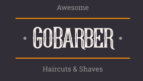

<h1 align="center">
    
</h1>

# GoBarber11_web
Versão web do GoBarber com Typescript e React com ensinamentos da [Rocketseat](https://rocketseat.com.br/).

## Sobre o GoBarber

GoBarber é um serviço de cadastramento de prestadores, o qual você pode se cadastrar como um e visualizar os agendamentos para o seu serviço. Por outro lado, o consumidor poderá selecionar e agendar com os prestadores de serviço, podendo se usufruir de uma aplicação completa restful, utlizando tanto a versão web, como a mobile.

Nesta versão responsiva web em específico foi criado o próprio hook useAuth, para transitar informações importantes entre páginas, e também foi criado do zero Toasts, ao invés de usar a lib para a dar os popup de sucesso/erros.

<p align="center">
  
</p>

## Dependências
Inicialmente é necessário você dar um:

```
yarn install
```
para baixar as dependências.

E depois rodar um:

```
yarn start
```
Para rodar a aplicação.

Para melhor visualização, é recomendado rodar o [backend](https://github.com/RenatoDTH/GoBarber11_api) da aplicação.
